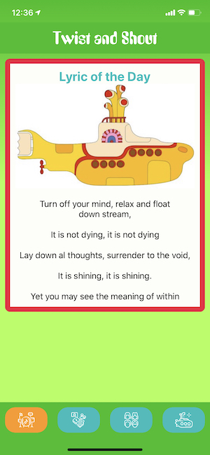

<h1 align="center">🎸 Twist and Shout - the Ultimate Beatles Tribute App 🎧</h1>

<p>
  
  <a href="https://twitter.com/jenlooper">
    
  </a>
</p>

## Featuring

🎸Daily Lyric: a random lyric selected from the 213 canonical songs in the Beatles discography

🎧Sergeant Pepper's Soundboard: Recreate the famous song, Tomorrow Never Knows, using loops

📱Album: Recreate the Hard Day's Night album cover with your own black and white selfies. Don't forget the beatnik hair!

✏New lyrics: RNN-generated lyrics



## Install

```sh
npm i
```

## Usage

Ensure that you have Android Studio and Xcode installed to run this app on mobile simulators. You will also need an instance of Firebase for running the custom model. Follow the instructions for running NativeScript's Firebase plugin [here](github.com/eddyverbruggen/nativescript-plugin-firebase).

This cross-platform mobile app is built with [NativeScript-Vue](http://www.nativescript-vue.org), running custom machine learning models built for TensorFlow lite and running on your device with the Firebase plugin referenced above. Data is sourced from Wine Spectator magazine as discovered via Kaggle, and stored in Azure table storage. The data is discoverable via an API built with Azure functions.

Fake lyrics were generated with [textgen-rnn](https://github.com/minimaxir/textgenrnn). Try your own versions [here](https://notebooks.azure.com/jennifer-looper/projects/beatles-generator?WT.mc_id=academic-0000-jelooper). Learn more about Azure Notebooks [here](https://docs.microsoft.com/azure/notebooks/azure-notebooks-overview?WT.mc_id=academic-0000-jelooper)

The slide deck explaining this project is [here](https://microsoft-cloud-advocates.slides.com/jenlooper/twistnshout)

```sh
tns run ios
```

or

```sh
tns run android
```

## Author

👤 **Jen Looper**

-   Twitter: [@jenlooper](https://twitter.com/jenlooper)
-   Github: [@jlooper](https://github.com/jlooper)

## Show your support

Give a ⭐️ if this project helped you!

---

_This README was generated with ❤️ by [readme-md-generator](https://github.com/kefranabg/readme-md-generator)_
